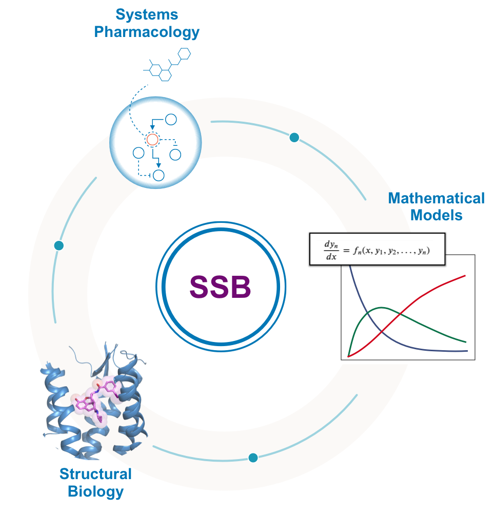

# SSBtoolkit

<div style="padding-bottom:50px">


</div>  
<br>
<br><br><br><br><br>
<br><br>
<p align="center"> 
  
</p>
<br><br>
In this tutorial series, you'll learn how to use the SSB (Structure Systems Biology toolkit) to simulate methematical models of signaling pathways of GPCRs.
The toolkit is designed for non-experts in computational systems biology and it is being continually updated with new SSB features and models.

The tutorials covers the core features of the SSBtoolkit python library. You don't need to follow all the tutorials orderly. You can just follow the one that suits your research interests. 

The tutorials are organized as follows:

What is about:
* [Introduction to Sructure Systems Biology ](/docs/structure_systems_biology.md)
* [The SSB toolkit explained](/docs/ssb_toolkit.md)


How to do:

1. [Simulation of dose-response curves of agonists using affinity values](SSBtoolkit-Tutorial1.ipynb) 
2. [Simulation of dose-response curves of antagonists using affinity values](SSBtoolkit-Tutorial2.ipynb)
3. [Simulation of dose-response curves of agonists using kenetic values](SSBtoolkit-Tutorial3A.ipynb)
4. [Simulation of dose-response curves of agonists using data acquired with tauRAMD](SSBtoolkit-Tutorial3B-tauRAMD.ipynb)
5. [Exploring SSB pathways associated to disease variants](SSBtoolkit-Tutorial4-OXTR.ipynb)


## Cite Us
If you use or adapt the SSBtoolkit for your own research projects please cite us.

```
@article{ribeiro_ssb_2022,
    title={{SSB} toolkit: from molecular structure to subcellular signaling pathways.},
    author={Ribeiro, Rui Pedro and Gossen, Jonas and Rossetti, Giulia and Giorgetti, Alejandro},
    publisher={bioRxiv},
    url={https://www.biorxiv.org/content/10.1101/2022.11.08.515595v1},
    doi={10.1101/2022.11.08.515595},
    year={2022}
}
```

## Acknowledgments

EU Human Brain Project (SGA1 and SGA2): This open source software was developed in part in the Human Brain Project funded from the European Union's Horizon 2020 Framework Programme for Research and Innovation under Specific Grant Agreements No 720270 and No. 78907 (Human Brain Project SGA1 and SGA2).

<div style="padding-bottom:50px">

    
</div>  