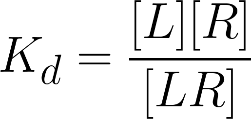
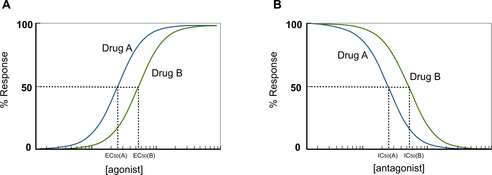
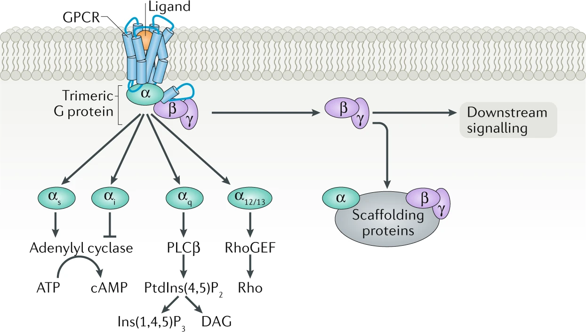
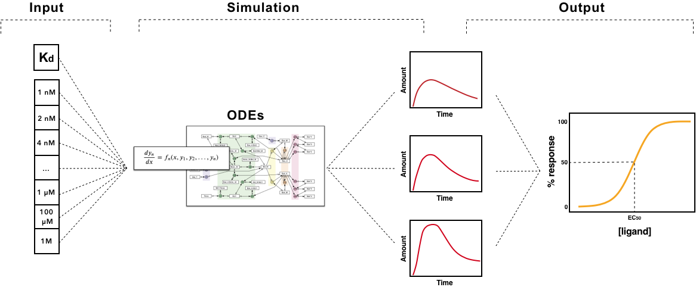

# SSBColab Documentation
              
 
 

## The SSB toolkit

The SSB computational toolkit was developed to easily predict classical pharmacodynamic models of drug-GPCR (class A) interactions given just as input structural information of the receptor and the ligand. The toolkit doesn’t use any novel or untested methods. Instead, it brings together free and/or open source bioinformatic tools into a user-friendly pipeline to be used by experts and non-experts. The pipeline was built, as a first instance, in a jupyter notebook – an interactive computational environment for replication and exploration of scientific code and analysis. Nowadays, jupyter notebooks are being extensively used by the computational biology community, making them the preferred choice to share and rerun computational protocols *([Rule, A et al., 2019](https://dx.plos.org/10.1371/journal.pcbi.1007007))*.

   

 
  

   

All the code under the toolkit was developed as a python module - a python file containing python classes, functions and statements. This helped us to modularize the code granting its readability, reusability, and deployment. Although the code will not be detailed in this thesis, many libraries were used for its development, such as [SciPy](https://www.scipy.org/), [Numpy](https://numpy.org/), [Matplotlib](https://matplotlib.org/), [Pandas](https://pandas.pydata.org/), [scikit-learn](https://scikit-learn.org/stable/index.html), [PySB](https://pysb.org/) and [Biopython](https://biopython.org/). 

   

<figure>

 

 <figcaptation align='center'>Fig. 1 - Structure Systems Biology toolkit’s pipeline.</figcaptation >
 
</figure>

   

## Drug-receptor binding affinities

The concept of drug-receptor binding constitutes the baseline of pharmacodynamics’ studies. When a drug or an endogenous ligand such as a neurotransmitter or a hormone binds though complementary to protein conformations, a cellular effect may result from that binding interaction (such as biochemical metabolic effects of second messengers or modulation of basal activity), which is typically described in quantitative terms. This complementary binding depends mainly on the affinity and efficacy of the ligand – parameters unique to its chemical structure *([Golan et al.,3rd. ed, 2012](https://www.google.com/books/edition/Principles_of_Pharmacology/WM7rvNUcrdsC?hl=en&gbpv=0))*. While the affinity of a ligand can be defined as a measure of how strong the ligand binds to the receptor, the efficacy is the measure of the maximum biological effect that results from the binding.

The affinity of a ligand to a receptor can be calculated according to the law of mass action, from which the equilibrium constant for bound versus unbound ligand is defined as the dissociation constant (Kd), as follows:
    
 (eq. 1)
     
 (eq. 2)
    
being [L], [R] and [LR] the ligand, receptor and the ligand-receptor complex’s concentration, respectively, and K d the equilibrium dissociation constant.
If one assumes that the concentration of the receptor is constant: = [LR] + [R] [Rtotal] ; it comes that:
    
 (eq. 3)
    
being [LR]/[Rtotal] the fraction of all available receptors that are bound to the ligand at equilibrium. That is to say that if the ligand acts as an agonist, according to the occupancy theory, this fraction represents the concentration of active receptors at equilibrium *([Golan et al.,3rd. ed, 2012](https://www.google.com/books/edition/Principles_of_Pharmacology/WM7rvNUcrdsC?hl=en&gbpv=0))*. From this equation, is possible then, to plot the fraction of bound receptors in the equilibrium over a range of ligand’s concentration, rendering the so-called drug-receptor binding curve (Fig.3).

   
<figure>

<figcaptation align='center'>Fig. 2 - Drug-binding curve. Since ligands can occur in a wide range of concentration values, if the ligand’s concentration is plotted semi-logarithmically, the hyperbolic shape of the curve becomes sigmoid. When the curve is presented in this way, a straight line can be obtained between 20% and 80% of the curve, being easy to calculate the concentration of ligand needed to activate specific a fraction of receptors. Moreover, it also makes easier to compare affinities between ligands.</figcaptation >
</figure>
   

Givin as input the experimental/computational Kd values for a ligand, with the SSBtoolkit it is then possible to obtain a drug-receptor binding curve for each ligand by calculating **eq.3** in function of a range of ligand concentrations. In the SSBtoolkit, by default, the range of ligand concentration is defined as a geometric progression of 20 concentration values between a minimum value (close to zero) and a maximum value defined by the user (normally, 3 orders of magnitude higher). In the end, a binding curve for each ligand is obtained by fitting a logistic regression to the discrete data:
    
 (eq. 4)
    
where Y is the response (the response of a drug-binding curve is the fraction of receptors occupied in the equilibrium); X, is the arithmetic ligand concentration; a , the response when X = 0; d , the response when X is equal to the maximum ligand’s concentration; c (for drug-repsonse curve, the c value corrresponds to the Kd value) ; is the concentration value corresponding to the halfway between a and d ; and b is the “slope” value that describes the steepness of the curve *([DeLean, A. et al., 1978](https://doi.org/10.1152/ajpendo.1978.235.2.e97))*.
The reason why a geometric progression is used to obtain the range of ligand concentrations, is due to the impact of the dilution factor on the accuracy of Kd and EC50/IC50, values experimentally estimated. This factor, that defines the spacing between the adjacent concentration values, has an impact on the concentration values that are on the linear portion of the curve. Using a geometric progression we can mimic the experimental conditions where each concentration equals the power of 2 of the previous lowest concentration ([Sebaugh, J.L., 2011](https://doi.org/10.1002/pst.426))*.
Obtaining then the drug-receptor binding curve for each ligand, allows us to compare the potencies between them. Considering the assumption that Kd  can be defined as the concentration of ligand at which 50% of the available receptors are occupied, the more the Kd shifts to right in the plot, the more ligand concentration is needed to achieve the 50% of available occupied receptors (see Fig. 2). In other words, the more the Kd goes to right in the plot the less potent the drug is.

However, this analysis is just valid if we are dealing with agonists. If antagonists come into play the scenario is different. By definition, an antagonist is a drug that inhibits the action of an agonist, having no effect in the absence of the agonist *([Neubig, R.R. et al., 2003](https://pharmrev.aspetjournals.org/content/55/4/597))*. Therefore, to incorporate the effect of a competitive antagonist, a modified version of **eq.3** must be applied:
    
 (eq. 5)
   
The only difference is the increase in the Kd of the effective ligand by a factor of: 1 + [L2] / Kd L2 *([Golan et al.,3rd. ed, 2012](https://www.google.com/books/edition/Principles_of_Pharmacology/WM7rvNUcrdsC?hl=en&gbpv=0))*.

In order to apply **eq.5** to obtain drug-receptor binding curve of an antagonist in the presence of an agonist we mimic computationally a binding assay experiment. In a radioligand binding assay, a known ligand for the target receptor is labelled with radioactivity and added to the system (cell or tissue). After reaching the equilibrium the radioligands are “washed out” and the effective ligand (radioactively unlabeled) is added to the system. The latter called “displacer”, will compete with the radioligand for the binding site in the receptor, and the stronger its affinity, the more effectively will bind and displace the radioligand. Such affinity can be inferred by the amount of radioactivity observed in the system *([Patrick, G.L. ,5th. ed, 2013](https://www.google.com/books/edition/An_Introduction_to_Medicinal_Chemistry/Pj7xJRuhZxUC?hl=en&gbpv=0))*.

In the same vein, in the SSBtoolkit, we obtain the drug-receptor binding curve of antagonist in the presence of an agonist applying then, the **eq.5** over a range of antagonist concentration values with a fixed concentration value for the agonist. However, to find the agonist concentration value that saturates the receptor, we have to calculate first its submaximal concentration, i.e., the concentration of agonist for which the fraction of occupied receptor reaches the maximum plateau on the agonist-receptor binding curve (Fig.2). This plateau can be defined as the upper bend point of the linear portion of the sigmoid curve *([Sebaugh, L.L. et al., 2003](https://onlinelibrary.wiley.com/doi/abs/10.1002/pst.62))*. Mathematically, this bend point can be obtained by calculating the maximum value of the derivative function of the logistic function (eq.4) with respect to b (Fig. 3) *([Sebaugh, L.L. et al., 2003](https://onlinelibrary.wiley.com/doi/abs/10.1002/pst.62))*.

As a matter of fact, in functional studies, the IC50, values of antagonists are useful if the concentration of the agonist is submaximal, because higher concentration of agonist increases the IC50, of antagonist well above its Kd *([Neubig, R.R. et al., 2003](https://pharmrev.aspetjournals.org/content/55/4/597))*.
   
<figure>

<figcaptation align='center'>Fig. 3 - Bending point – The red curve is the first derivative with respect to b. The minimum and maximum values of this curve give us the bending points. The green curve is the first derivative with respect to b and x. The bending points can be obtained resolving numerically this function in order a zero. Figure adapted from *[Sebaugh and McCray, 2003](https://onlinelibrary.wiley.com/doi/abs/10.1002/pst.62)*.</figcaptation >
</figure>
   

## Simulation of signaling pathways

Up to this point, how  drug-receptor binding curves are obtained from ligand-receptor affinity constants. However, the pharmacodynamics of a drug is characterized by the relationship between the dose – i.e., the drug’s concentration – and the response to that drug.

Since drug targets are coupled to the cell through a myriad of biochemical reactions, the response of a drug is characterized by signaling effects of second messengers or the modulation of basal activity of the cell. In functional studies, this response is normally represented by a dose-response curve (Fig.4) from which the potency parameters can be deduced. The potency parameter expresses the activity of a drug in terms of concentration of ligand needed to produce a defined effect, which is normally defined by the EC50, and IC50, values for agonist and antagonist, respectively. While EC50, represents *“the molar concentration of an antagonist that produces 50% of the maximal possible effect of that agonist”* *([Neubig, R.R. et al., 2003](https://pharmrev.aspetjournals.org/content/55/4/597))*, the IC50, represents *“the molar concentration of an antagonist that reduces the response to an agonist by 50% or the concentration of agonist should be given”* *([Neubig, R.R. et al., 2003](https://pharmrev.aspetjournals.org/content/55/4/597))*.

   
<figure>

<figcaptation align='center'>Fig. 4 - Dose-response curve demonstrating the effect of a drug as a function of its concentration.</figcaptation >
</figure>
   

Typically, it is assumed that the response of a drug is proportional to the fraction of activated receptors, however, this assumption is not valid for the so-called *“spare receptors”* like GPCRs. That is to say that the maximum response of a GPCR can be achieved with less than 100% of occupancy *([Golan et al.,3rd. ed, 2012](https://www.google.com/books/edition/Principles_of_Pharmacology/WM7rvNUcrdsC?hl=en&gbpv=0))*. As this implies, we can’t estimate the EC50/IC50, of ligands of GPCRs without including the signaling pathway associated with these receptors.

Under the umbrella of systems biology, descriptive models of signaling pathways can be used to predict cellular responses. This is possible due to the fact that signaling pathways are an intricate series of molecular events, commonly protein phosphorylation catalyzed by kinases, that can be described by mathematical equations. So, by simulating a mathematical model of a signaltransduction pathway it is possible to predict how the concentration of species (metabolites and proteins) change over time depending on certain initial conditions *([Stein, M., 2007](https://linkinghub.elsevier.com/retrieve/pii/S0959440X07000449))*. Therefore, mathematical models of the GPCR signaling pathways make part of the core of the SSBtoolkit.

Since G-protein subfamilies are classified by their α subunits, this classification has been served to define either the receptor and the effector coupling, and also the signaling pathway *([Neves, S.R., 2002](https://www.sciencemag.org/lookup/doi/10.1126/science.1071550))*. Hence, GPCR pathways have been divided into four families: Gs , Gi/o , Gq/11 , and G12/13 (Fig.5).
   
<figure>

<figcaptation align='center'>Fig. 5 - GPCRs' signaling pathways. Figure taken from *[Pfleger et al., 2019](https://www.nature.com/articles/s41569-019-0220-3)*.</figcaptation >
</figure>
   

To implement the GPCR signaling pathways in the SSBtoolkit we developed them based on pre-existing models. The G s and G i/o pathways were implemented based on the model proposed by *[Nair et al., 2015](https://www.ncbi.nlm.nih.gov/pmc/articles/PMC4604235)*, whereas the Gq/11  pathway were based on the model proposed by *[Chang et al., 2009](https://www.ncbi.nlm.nih.gov/pmc/articles/PMC2635340)*. Although we didn’t find, in the literature, a suitable descriptive model for the G12/13 signaling pathway, this pathway shares the same receptors as the Gq/11 pathway. Moreover, from all known human GPCRs, just 1% of them are known to couple the Gq/11 signaling pathway (Fig.6).

   
<figure>

<figcaptation align='center'>Fig. 6 - Percentage of human GPCRs in function of their G protein. Data based on [GPCRdb](https://gpcrdb.org/) and [REACTOME](https://gpcrdb.org/) database (last access on December 2020) (UNK = unknown).</figcaptation >
</figure>
   

All the three signaling pathways were developed using the [PySB](https://pysb.org/) toolkit, designed specifically for systems biology. Essentially, with PySB [PySB](https://pysb.org/) we start by defining all the species, initial concentrations, reactions and reactions constants. Then, all the differential equations are integrated over an array of time, and finally, the variation of the concentration of specific metabolites over time are obtained.

To predict a dose-response curve from the simulation of signaling pathways, individual simulations of the pathway according to an array of ligand concentrations must be performed first. The dose-response curve is, then, obtained by fitting a logistic regression (eq.4) to the maximum response values from each individual simulation. In the end, a curve of the response in function of the ligand concentration is obtained (Fig.7). The response of a signaling pathway is, naturally, represented by the increase or decrease of one of the species described by the model. Therefore, for each signaling pathway we defined, by default, a reference species. While cAMP was chosen as reference species for the Gs and Gi/o pathway, for the Gq/11 pathway we chose IP3 , Fig.5.
   
<figure>

<figcaptation align='center'>Fig. 7 - Conceptual scheme for predicting dose-response through signaling pathways’ simulation. For each concentration value the signaling model is simulated obtaining in the end several curve of the concentration of a specific species of the pathway as function of time. After, the maximum value of each curve is selected and plotted, resulting, in the end, in the dose-response curve.</figcaptation >
</figure>
   

Since the comparison between drugs’ potencies should only be made under specific experimental conditions *([Neubig, R.R. et al., 2003](https://pharmrev.aspetjournals.org/content/55/4/597))*, the SSBtoolkit might become a computational approach to systematically assess pharmacodynamic parameters during virtual screening campaigns against GRCRs.

#### Previuos topic: 
[Introduction to Sructure Systems Biology ](/docs/structure_systems_biology.md)
#### Go to SSBColab git homepage: 
[SSBtoolkit ](https://github.com/rribeiro-sci/SSBtoolkit)

